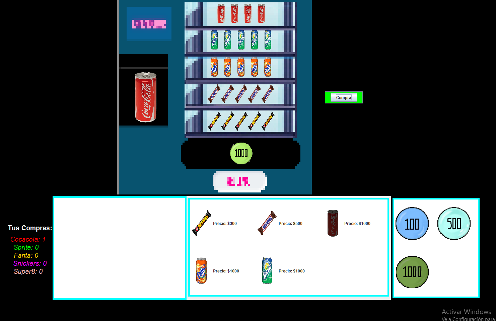
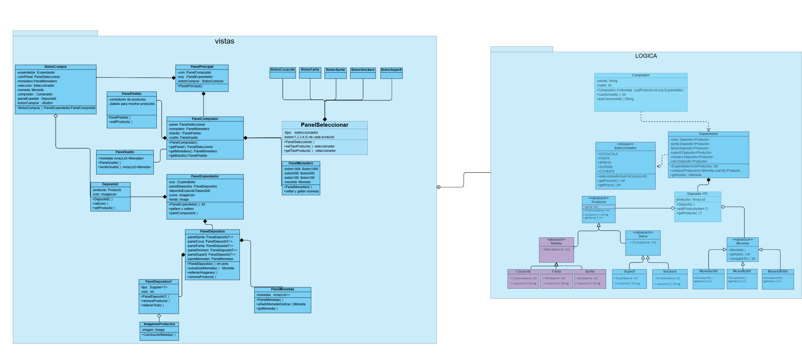

# Tarea 3: SuperExpendedor
Gabriela Escalona Weldt
### Screenshot de la ventana:

### Diagrama UML: Se generalizaron algunos atributos y metodos con
### con el fin de no saturar el UML con tanta redundancia  
### -Botones de productos
### -Clases Jpanel de imagenes de productos
### -PanelPedido los contadores y JLabels de cada producto

